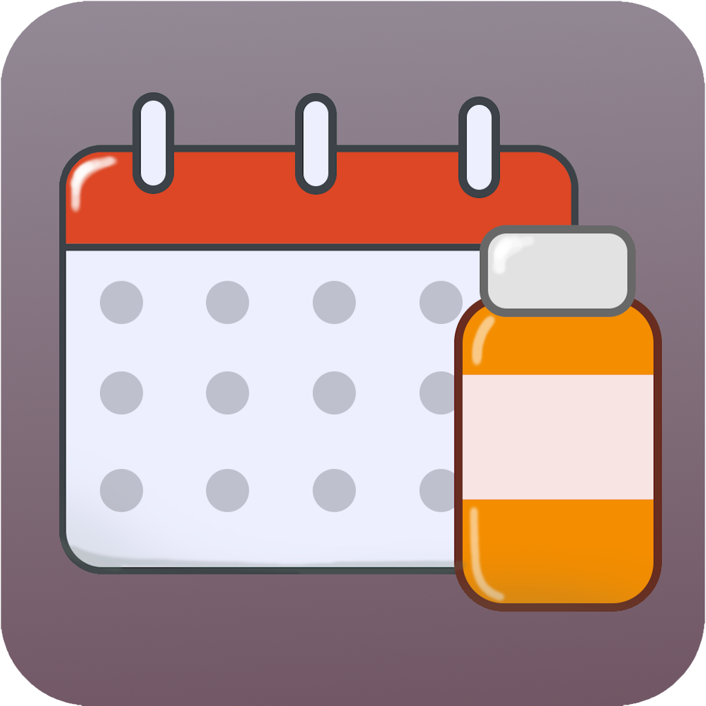

# Medicine reminder
Automatically add reminders to Google Calendar for when medicine expires by scanning the data matrix

## Development
### Requirements:
* Docker (On Windows: WSL enabled)
* VSCode with dev container extensions installed
* A free [ngrok](https://ngrok.com/) account
* A Google Cloud project

### Install
0. (Windows: Clone inside WSL)
1. Re-open in dev container
1. Create a Google Cloud project, set up a consent screen, create api key and oauth2.0 client id
1. Add your ngrok static domain to "Authorized JavaScript origins" under your client id and to "Website restrictions" under your api key
1. Add your ngrok auth token:
    ```bash
    ngrok config add-authtoken <your auth token>
    ```
1. Install dependencies:
    ```bash
    npm install
    ```
1. Run webpack dev server:
    ```bash
    npm run dev
    ```
1. In a different terminal, start ngrok tunnel
    ```bash
    ngrok http --url=<your static domain> http://localhost:8080
    ```
1. Open &lt;your static domain&gt; in a browser